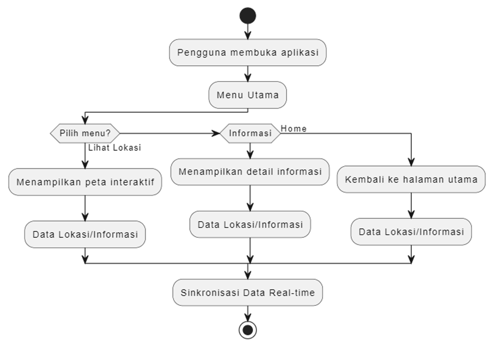

# Mobile Apps Tracking Data Lokasi Layanan Isolasi Mandiri

## Introduction
Aplikasi Mobile Apps Tracking Data Lokasi Layanan Isolasi Mandiri dirancang untuk menyediakan informasi lokasi serta status kesehatan individu, dengan fokus pada layanan isolasi mandiri. Aplikasi ini menggunakan peta interaktif dan detail deskripsi lokasi sebagai fitur utamanya, didukung oleh desain antarmuka yang sederhana untuk mempermudah penggunaan.

## Objective
Mempermudah pengguna untuk:
1. Mengetahui lokasi terakhir individu yang sedang dipantau.
2. Melihat status kesehatan individu tersebut secara real-time.
3. Mendapatkan deskripsi singkat mengenai lokasi individu melalui peta interaktif.

## Scope
- **Batasan**:
  - Tidak ada batasan dalam mengakses aplikasi ini, kecuali koneksi internet.
- **Kriteria**:
  - Pengguna dapat melihat lokasi terkini individu yang dipantau.
  - Pengguna dapat membaca deskripsi lokasi dan status kesehatan secara detail.

## Businees Requirement
1. **Business Requirement Definition**
   - **Produk**: Aplikasi Mobile Tracking Data Lokasi.
   - **Jenis Layanan**: Layanan Informasi Berbasis Online.
   - **Definisi**: Solusi berbasis mobile untuk memantau lokasi dan status kesehatan individu dalam layanan isolasi mandiri.
   - **Abstrak**
   Dalam era digital yang terus berkembang, kebutuhan untuk mengakses informasi lokasi secara cepat dan efisien menjadi sangat penting. Aplikasi ini membantu masyarakat dan pihak terkait memantau lokasi individu serta memberikan informasi status kesehatan mereka. Fitur utama meliputi Peta interaktif, Deskripsi lokasi dan, Status kesehatan real-time.

## Penjelasan Fungsi
1. **Fungsi Teknis**
   - **Maps Interaktif**: Menampilkan lokasi individu secara visual menggunakan OpenStreetMap.
   - **Informasi Deskriptif Lokasi**: Memberikan deskripsi detail terkait lokasi individu serta status kesehatannya.

2. **Fungsi Strategis**
   - **Kinerja**: Mempermudah pengguna memantau lokasi serta status kesehatan individu secara efisien.
   - **Keunggulan**: Antarmuka yang sederhana membuat pengguna mudah memahami informasi.

## Fungsional & Spesifikasi
1. **Framework**: Flutter
   - **Alasan Penggunaan**: Mendukung pengembangan aplikasi lintas platform dengan performa tinggi dan desain responsif.
2. **Paket yang Digunakan**:
   - **flutter_map** (v4.0.0): Untuk peta interaktif berbasis OpenStreetMap.
     - Mendukung berbagai jenis peta.
     - Memfasilitasi visualisasi lokasi pengguna dan rute antar titik.

## Process Flows

  ## Spesifikasi
Spesifikasi Aplikasi Mobile Tracking Data Lokasi
### Framework
- **Flutter**: Framework utama yang digunakan untuk mengembangkan aplikasi ini, karena mendukung pengembangan aplikasi lintas platform dengan performa tinggi dan desain responsif.

### Maps
1. **flutter_map**
   - **Versi**: 4.0.0
   - **Fungsi**: Digunakan untuk menambahkan peta interaktif berbasis OpenStreetMap.
   - **Keunggulan**:
     1. Mendukung berbagai jenis peta.
     2. Menampilkan lokasi pengguna dan informasi geografis secara interaktif.
     3. Penerapan: Menampilkan lokasi pengguna dan rute antar titik pada peta digital.
2. **latlong2**
   - **Versi**: 0.8.1
   - **Fungsi**: Menyediakan tipe data dan fungsi untuk bekerja dengan koordinat geografis (latitude dan longitude).
   - **Keunggulan**:
     1. Mempermudah manipulasi titik koordinat geografis.
     2. Berguna untuk melakukan perhitungan jarak dan arah antar titik.

### Keunggulan Teknologi
- **Integrasi flutter_map dan latlong2**:
  - Digunakan bersama untuk menentukan lokasi titik pada peta.
  - Mendukung perhitungan jarak dan rute secara akurat.
  - Memaksimalkan visualisasi peta interaktif dalam aplikasi.

### Sumber Data
- **OpenStreetMap**: Digunakan sebagai sumber data peta yang detail dan up-to-date.

## Alur Proses
1. Pengguna membuka aplikasi.
2. Aplikasi menampilkan lokasi individu secara real-time di peta interaktif.
3. Pengguna dapat mengakses informasi detail lokasi dan status kesehatan individu tersebut.
